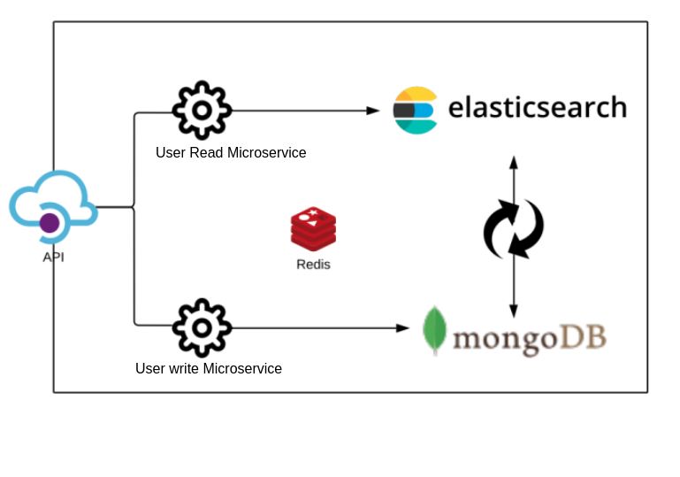
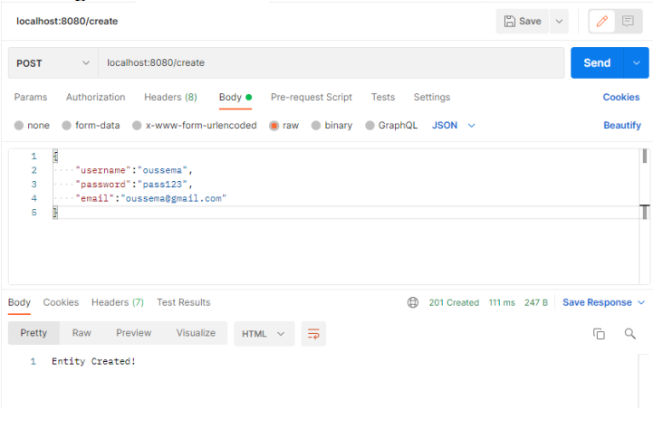
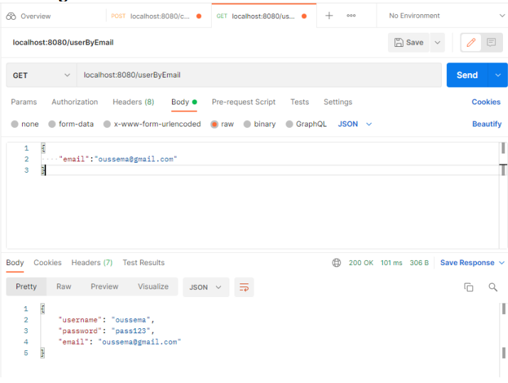

# Software Architecture Lab5
This repository holds the microservice(s) components our group did as part of a whole class project to implement a microservice cluster of an online shopping web application.
Because the microservice component are limited are the number of groups vastly outnumbers the available microservices to implement, we chose to handle user creation in an optimized way that handles the scale of a massively used Online shopping website.
## Architecutre

## Summary
This project consists of 3 main microservices and 1 internal:
* API Gateway: This is the edge point of our microservice cluster, It can be integrated with other colleagues microservices in an aggregation API gateway that will aggregate all the other Gateways developed by our colleagues.
* User Creation Microservice: This microservice will handle the entity creation of the users, writing in mongodb
* User fetching Microservice: Because the number of user reads outweighs the number of user writes in a mass-scale online shopping app, we choose to fetch the user data from Elasticsearch to leverage the fast indexing full text search engine for much faster read speed.
* Internal Synchronization microservice: This component will handle the synchronization between elasticsearch and mongodb.
## Technical details:
### Messages vs Events:
We need to understand the difference between them to choose what to use correctly.
When a user invokes a Get request, he’s expecting a response. So the TCPconnection has to be kept open until the cluster is done processing and returns the result to the API gateway so it returns it to the user. This is what we call a response overhead. When such case is expected, This is the correct place to use Messaging.
However when we are not expecting a response overhead from within thecluster. It’s advised to use Events.
### Asynchronisity:

For the User creation part, Because we are not really expecting a response from our microservice cluster, so we don't need to wait for the Response overhead. For this reason we used Event communication.
The gateway pushes an event with the appropriate payload inside a Redis Queue, then the microservice consumes it when idle to execute the command. The gateway returns a 201 result to the User if it parsed the payload properly.
### Solution tests:
#### Creating users:

#### Fetching users:

## Running the Project:
This cluster is deployed on a docker-compose stack. To run it on your environment, make sure that you have Docker & Docker-compose installed on your machine. Clone the repository then run `docker-compose up`.

